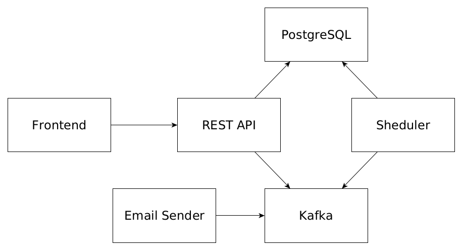

# Планировщик задач
Многопользовательский планировщик задач.
Пользователи могут использовать его в качестве TODO листа.

- [Функционал](#desc)
- [Технологический стек](#frameworks)
- [Сервисы](#service)
- [Как запустить локально](#run)

<a name="desc"></a>
## Функционал
Работа с пользователями:
- Регистрация
- Авторизация
- Logout

Работа с задачами:
- Создание, редактирование (каждая задача имеет заголовок и описание)
- Пометка задачи как сделанной
- Удаление

Оповещение пользователей по email:
- Приветственное письмо
- Каждый день в полночь оповещение о том, сколько задач было сделано за прошедшие сутки, и какое количество осталось невыполненными

<a name="frameworks"></a>
## Технологический стек
- Java
- Gradle
- Spring Framework (Boot, MVC, Security, Data, Mail)
- PostgreSQL
- Liquibase
- Kafka
- React
- Docker

<a name="service"></a>
## Сервисы

#### REST API
Spring Boot приложение, реализующее REST API для работы с пользователями и задачами.
#### Фронтенд
Образ фронтенд сервиса содержит веб-сервер Nginx, раздающий статику.
#### Рассыльщик писем
Spring Boot приложение, которое подключается к Kafka и подписывается на сообщения, поступающие от планировщика и сервиса, реализующего REST API.
При получении сообщения с помощью Spring Mail отправляется письмо с соответствующим содержимым.
#### Планировщик
Задача сервиса - раз в сутки итерировать всех пользователей, и формировать для них отчёты о задачах и изменениях в них за сутки.
- Пользователям, у которых на конец дня есть невыполненные задача, отправляется емейл вида "У вас осталось N несделанных задач".
Тело письма содержит заголовки этих задач.
- Пользователям, у которых за последние сутки 1 или более задач были отмечены как сделанные, отправляется емейл вида “За сегодня вы выполнили N задач”.
Тело письма содержит заголовки выполненных задач.
- Пользователям, для которых верны оба условия выше, отправляется емейл и со списком несделанных, и сделанных за последние сутки задач


<a name="run"></a>
## Как запустить локально
1. Для запуска сервиса отправки писем установите логин, пароль, хост и порт SMTP сервера в docker-compose файле.
2. Запустите контейнер с приложением:
```
docker compose up -d
```
По умолчанию описание rest api доступно по пути /v1/api-docs, swagger - /v1/swagger-ui.
Порты для rest api и frontend 8080 и 5173.